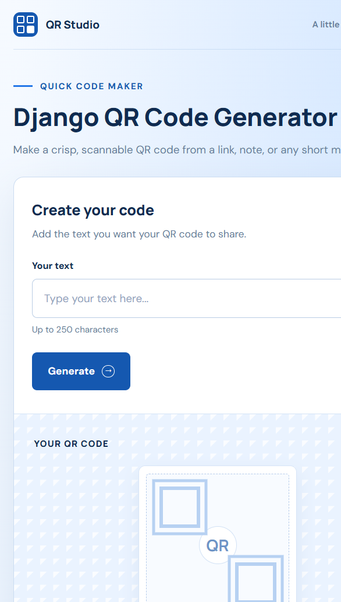

# QR Studio

A small Django app that turns text or a URL into a downloadable QR code PNG.

## Features

- Generate QR codes from plain text, phone links, or web URLs.
- Accepts up to 250 characters and rejects blank input.
- Stores each QR image with a filesystem-safe unique filename.
- Displays the result with a PNG download link.

## Requirements

- A Python version supported by the pinned packages in `requirements.txt`.
- pip

The project was developed locally with Python 3.14.5 and Django 6.1.1.

## Run Locally

From the project root, create and activate a virtual environment, install dependencies, apply migrations, and start Django:

```powershell
python -m venv .venv
.\.venv\Scripts\Activate.ps1
python -m pip install -r requirements.txt
python manage.py migrate
python manage.py runserver
```

On macOS or Linux, activate the environment with:

```sh
source .venv/bin/activate
```

Open [http://127.0.0.1:8000/](http://127.0.0.1:8000/) in a browser.

## Use the App

1. Enter up to 250 characters in the text field. This can be plain text or a link such as `https://example.com/`.
2. Select **Generate**.
3. Scan the QR code or select **Download PNG**.

## Screenshots

The initial screen provides a text field and an empty QR preview:



After submitting a URL, the generated QR code and PNG download link appear in the result panel:


## Tests

Run the QR app tests with:

```sh
python manage.py test qrcodeapp
```

The tests cover QR generation for ordinary text and an HTTPS URL, stored image files, and blank input validation.

## Project Layout

- `dj_QR/` contains project settings and URL/WSGI configuration.
- `qrcodeapp/` contains the QR model, view, URL route, and tests.
- `templates/` contains the generator page.
- `static/` contains CSS, JavaScript, and the app icon.
- `media/qr_code/` stores generated QR images at runtime.
- `screenshots/` contains the README screenshots.

The app uses SQLite by default; no managed MySQL or PostgreSQL service is required.

## PythonAnywhere Deployment Preparation

The project is prepared for a manual PythonAnywhere deployment, but has not been deployed yet. Before publishing:

1. Confirm PythonAnywhere offers a Python version supported by the pinned dependencies.
2. Create a manual Django web app, upload or clone this project, create a virtual environment, and install `requirements.txt`.
3. Configure these environment variables in the web app:

   - `DJANGO_DEBUG=False`
   - `DJANGO_SECRET_KEY` with a newly generated, private random value
   - `DJANGO_ALLOWED_HOSTS` set to your `username.pythonanywhere.com` hostname

4. Set the WSGI configuration to use `dj_QR.settings`.
5. Run `python manage.py migrate` and `python manage.py collectstatic --noinput`.
6. In the Web tab, map `/static/` to the deployed project's `staticfiles/` directory and `/media/` to its `media/` directory.
7. After confirming HTTPS works correctly, configure HTTPS redirection and consider HSTS. Django's deployment check currently warns that these two settings are not enabled.

The development database, generated media, virtual environments, local secrets, and collected static output are excluded by `.gitignore`. The project is tracked on GitHub at [Django-QR-Code-Generator](https://github.com/tsalajunior/Django-QR-Code-Generator).

## Current Development Note

The generator works, but the browser currently reports a JavaScript error from `static/js/main.js` related to the character counter. The counter may not update until that issue is fixed.